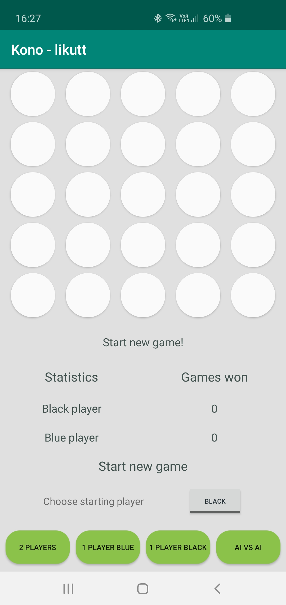
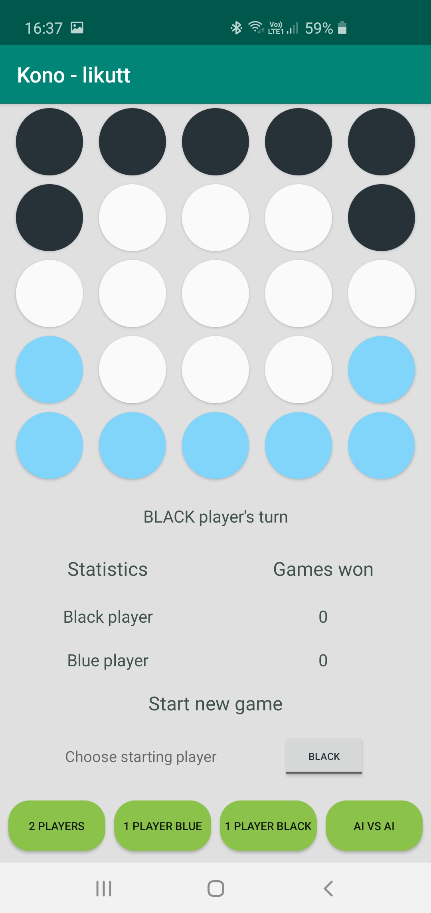
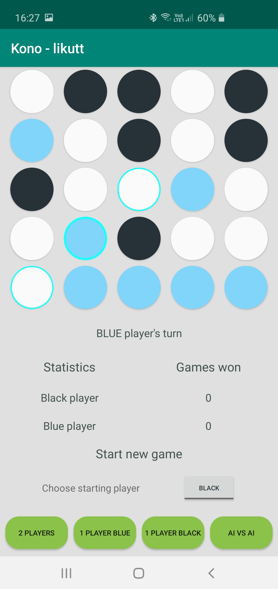
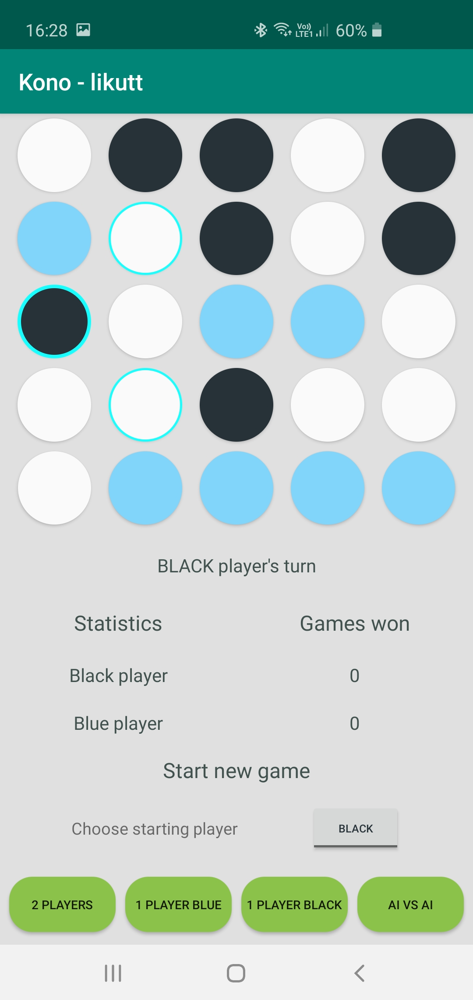
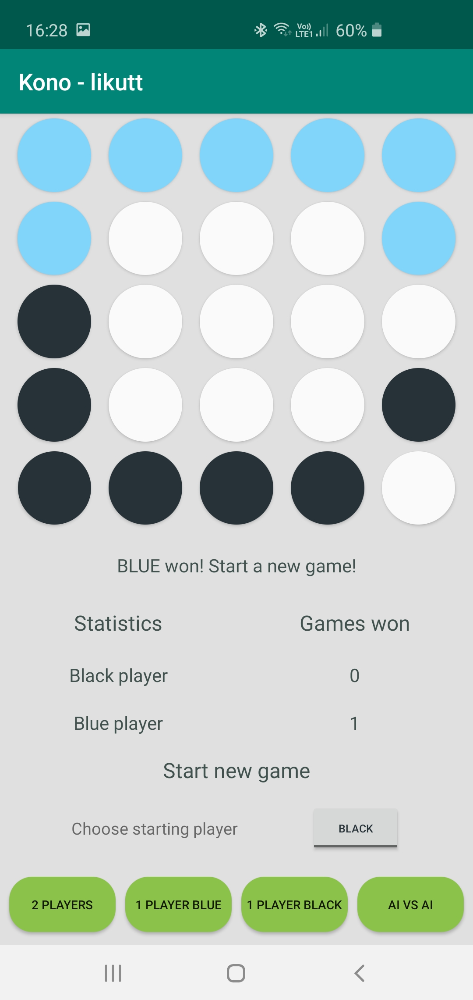
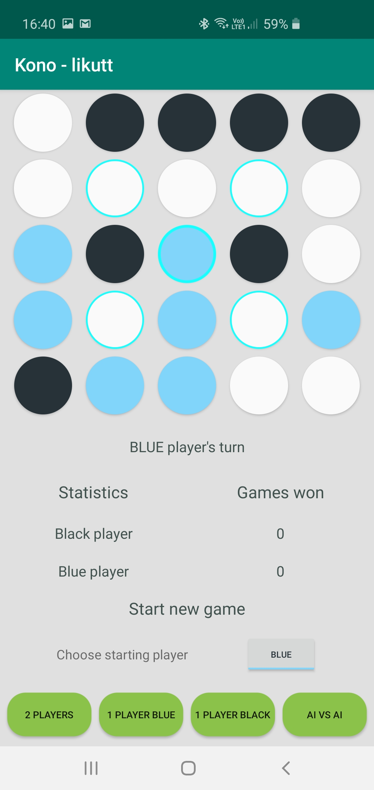
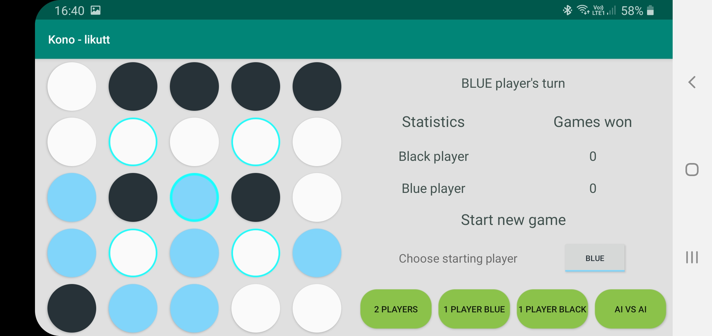

# Kono

Kono game in Kotlin

https://en.wikipedia.org/wiki/Five_Field_Kono
https://www.youtube.com/watch?v=T1lBtF1Pilk

Available gaming modes - 2 player, 1 player vs AI, AI vs AI.
It's possible to choose, which side starts.
UI supports rotation and is responsive.

Samsung Galaxy S10 - portrait start game | Samsung Galaxy S10 - portrait game started
------------ | -------------
 | 

Samsung Galaxy S10 - portrait blue player's turn | Samsung Galaxy S10 - portrait black player's turn
------------ | -------------
 | 

Samsung Galaxy S10 - portrait blue player won |
------------ |
 |

Samsung Galaxy S10 - portrait blue player's turn | Samsung Galaxy S10 - landscape blue player's turn
------------ | -------------
 | 
